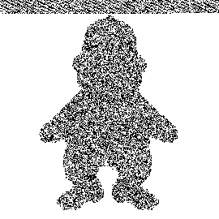
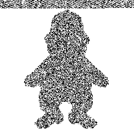
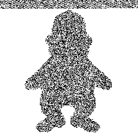

# Python-Steganography

Este projeto implementa um algoritmo simples de esteganografia em Python utilizando a técnica de LSB (Least Significant Bit) para ocultar mensagens em imagens. A esteganografia é uma técnica de segurança de dados que envolve ocultar informações dentro de outras, tornando as mensagens ocultas praticamente imperceptíveis a olho nu.


## Como Funciona

A técnica LSB (Least Significant Bit) consiste em modificar os bits menos significativos de cada pixel de uma imagem para armazenar informações sem alterar de forma perceptível a imagem. Essa técnica pode ser usada para esconder mensagens de texto, que são codificadas diretamente nos pixels da imagem.


## Funcionalidades

- **Codificar Mensagem:** Permite esconder uma mensagem de texto dentro de uma imagem.
- **Decodificar Mensagem:** Permite extrair a mensagem oculta da imagem.
- **Suporte a Formatos Comuns de Imagens:** O algoritmo pode ser usado com imagens em formato PNG, GIF, JPEG.


## Requisitos

Para rodar este projeto, você precisa ter o Python 3.x instalado. Além disso, é necessário instalar as bibliotecas abaixo:

```bash
pip install pillow
```

A biblioteca `Pillow` é usada para manipulação de imagens.


## Como Usar

Este projeto oferece uma ferramenta de linha de comando que pode ser executada com o `argparse`.

### Execução

Você pode executar o script [`steganoPy.py`](./steganoPy.py) com as seguintes opções:

```bash
usage: steganoPy.py [-h] (-d | -e) -i INPUT [-m MENSAGEM] [-l TAMANHO]

Tool de esteganografia utilizando LSB

options:
  -h, --help            show this help message and exit
  -d, --hide            Esconder uma mensagem em uma imagem
  -e, --extract         Extrair uma mensagem de uma imagem
  -i INPUT, --input INPUT
                        Caminho para a imagem de entrada
  -m MENSAGEM, --mensagem MENSAGEM
                        Mensagem a ser escondida (necessário com -d)
  -l TAMANHO, --tamanho TAMANHO
                        Tamanho da mensagem a ser recuperada (necessário com -e)
```

### Exemplos de Uso

#### Codificando uma Mensagem (Escondendo uma Mensagem)

Para esconder uma mensagem dentro de uma imagem, use a opção `-d` (ou `--hide`), fornecendo o caminho da imagem de entrada e a mensagem que você deseja esconder:

```bash
python steganoPy.py -d -i imagem.png -m "mensagem secreta"
```

#### Decodificando uma Mensagem (Extraindo uma Mensagem)

Para extrair a mensagem oculta de uma imagem, use a opção `-e` (ou `--extract`), fornecendo o caminho da imagem e o tamanho da mensagem que foi escondida:

```bash
python steganoPy.py -e -i imagem.png -l 16
```

Neste exemplo, o tamanho da mensagem a ser recuperada é `16` caracteres.

### Exemplo de Esteganografia com LSB

> **Nota**: A letra da música "Bad Apple" foi utilizada como exemplo na imagem abaixo.

| Imagem original                            | Imagem com mensagem oculta                     |
|--------------------------------------------|------------------------------------------------|
|    |  |

### Exemplo de Visualização de Bits LSB

| Canal vermelho                 | Canal verde                        | Canal azul                       |
|--------------------------------|------------------------------------|----------------------------------|
|  |  |  |
|                                |                                    |                                  |


## Estrutura do Projeto

```
.
├── steganoPy.py                    # Código principal de esteganografia com argparse
├── images/                         # Pasta contendo as imagens utilizadas e geradas
│   ├── purpleMonkey.png            # Imagem de exemplo para esconder a mensagem
│   ├── steg_1744445849519.9663.png # Imagem com a mensagem oculta
│   ├── lessRED.png                 # Visualização do bit menos significativo (LSB) no canal vermelho
│   ├── lessGreen.png               # Visualização do bit menos significativo (LSB) no canal verde
│   ├── lessBLUE.png                # Visualização do bit menos significativo (LSB) no canal azul
├── README.md                       # Este arquivo
└── requirements.txt                # Arquivo de dependências
```


## Créditos:

- **Imagens do BonziBuddy**: Personagem criado por **Bonzi Software, Inc.** — usado aqui de forma paródica/meme com fins educacionais e sem fins lucrativos
- **Letra da musica usada no exemplo**: "Bad Apple" by **Alstroemeria Records** featuring **Nomico**
- **Tradução em inglês**: [LyricsTranslate](https://lyricstranslate.com/en/bad-apple-english-version-腐った林檎.html)
- **Ferramenta para visualizar bits na imagem**: [StegOnline](https://www.georgeom.net/StegOnline/upload)

## Licença

Este projeto é licenciado sob a licença MIT - veja o arquivo [LICENSE](LICENSE) para mais detalhes.
